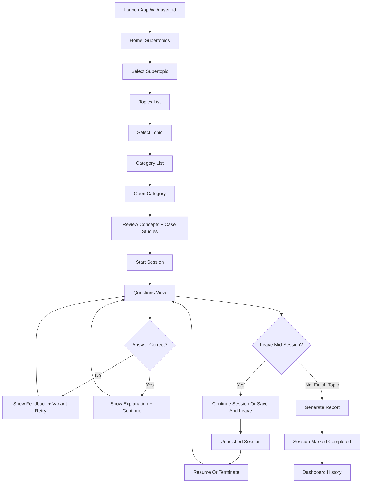

# Adaptive App User Flow

This document describes the end-to-end learner journey through the Adaptive CME app as a standalone product flow. It is intended to be readable without referring back to the technical README.

Validated locally on April 16, 2026 with:
- App URL: `http://127.0.0.1:3000`
- User ID: `27114766-192e-40dc-92a4-aae2155a2dcb`

## 1. What the learner experiences

The Adaptive CME app is a guided learning system for pediatric topics. A learner:
- enters the app with a known `user_id`
- chooses a supertopic
- chooses a topic
- browses topic content by category
- reviews concepts and case studies
- starts an adaptive question session
- receives immediate answer feedback and explanations
- can leave and resume unfinished work
- finishes the session and receives a generated performance report
- sees historical sessions in the dashboard

## 2. Entry conditions

The app expects the learner to arrive with a valid internal user identity.

Typical production entry:
- the Education Platform launches the app
- the backend resolves or creates the internal user
- the frontend opens as `/?user_id=<uuid>`

Local validation note:
- this supplied user ID was not present in the local `users` table at first
- a local test user row was added so the full session flow could be exercised for this exact ID

## 3. Primary journey

## 4. Screen-by-screen flow

### 4.1 Home

What the learner sees:
- app title and landing page
- supertopic cards
- `Dashboard` button

Current supertopics in local validation:
- `Pediatric Infectious Diseases`
- `Pediatric Nutrition`

Learner actions:
- choose a supertopic to browse topics
- open the dashboard to review previous sessions

### 4.2 Dashboard

Empty-state behavior:
- if the learner has no recorded sessions, the dashboard shows a no-history message

Populated-state behavior:
- each row represents a session attempt for a topic
- status may reflect active unfinished work as `not-completed`
- completed sessions can also include score and question totals when a report has been generated

### 4.3 Topics list

After selecting a supertopic:
- the learner sees the topics available inside that supertopic
- each topic card invites the learner to begin with concepts before questions

Observed example:
- `Pediatric Infectious Diseases` currently exposes `TYPHOID & ENTERIC FEVER`

### 4.4 Category list

After selecting a topic:
- the learner lands on a category view, not directly inside questions
- each category shows:
  - number of concepts
  - number of case studies
  - number of questions

Important rule:
- if a subtopic has no explicit `category`, the subtopic title is used as the category label

This makes the topic feel structured before the learner begins assessment.

### 4.5 Category detail

When the learner opens a category:
- the app shows the grouped concept and case-study content for that category
- case studies are displayed together with the related concept material
- the bottom action bar remains visible

Available actions:
- `Back to Categories`
- `Start Session`

## 5. Adaptive question session

### 5.1 Starting the session

When the learner clicks `Start Session`:
- a backend session is created
- the learner is moved into the questions view
- the app starts at the first question in the topic-level sequence

The question view includes:
- breadcrumb navigation
- progress indicator
- `Concept`, `Question`, and `References` tabs

### 5.2 Answering a question

For each question, the learner:
- selects one answer
- submits it
- receives immediate feedback

If the answer is incorrect:
- the app records the attempt
- the learner is shown answer-level rationale
- the app moves to a variant retry when one is available
- the retry may use a reworded stem rather than the original wording

If the answer is correct:
- the app shows a review state with:
  - the correct answer
  - incorrect options
  - option rationales
  - explanation text
- the learner clicks `Continue Learning` to move on

### 5.3 Tabs inside the session

`Concept` tab:
- shows the current subtopic or case-study teaching content

`Question` tab:
- shows the active MCQ and answer workflow

`References` tab:
- shows supporting citations or reference excerpts when available

## 6. Leaving an unfinished session

If the learner tries to leave while a session is in progress:
- clicking `Home` does not abruptly throw them out
- the app opens a focused dialog:
  - `Continue Session`
  - `Save and Go to Home`

This is the active-session protection flow.

If the learner chooses `Save and Go to Home`:
- the session is snapshot-saved to the filesystem
- the database session is marked as abandoned/not completed
- the learner is returned to the home screen

## 7. Resume flow

After an unfinished session has been saved:
- a browser refresh or fresh app entry shows an `Unfinished Sessions` screen
- the learner is offered:
  - `Continue Session`
  - `Terminate`
  - `Back to Home`

If the learner clicks `Continue Session`:
- the app restores the unfinished session
- the learner returns to the question sequence
- progress resumes from the saved attempt state rather than restarting the topic

If the learner clicks `Terminate`:
- the saved unfinished session snapshot is deleted
- the learner can start fresh later

## 8. Completion and report flow

When the learner completes the topic session:
- the backend generates a markdown performance report
- the report is built from live attempts or persisted attempts
- the session summary is saved
- the session status is changed to `completed`
- unfinished snapshot data is cleared

The report stage is responsible for:
- total questions
- total correct
- score percentage
- per-subtopic performance breakdown
- narrative learning feedback

If platform callback integration is enabled:
- the backend sends a final result callback to the Education Platform
- the callback includes score, credits, session ID, and time spent

## 9. Dashboard after learning

Once sessions exist, the dashboard becomes the learner’s history surface.

It can reflect:
- completed sessions
- unfinished or abandoned sessions
- topic names
- timestamps
- report-derived score metadata when available

This makes the dashboard the learner’s return point for longitudinal review.

## 10. Important alternate paths

### First-time learner path
- home opens directly
- dashboard is empty
- no resume prompt appears

### Interrupted learner path
- learner begins a topic
- leaves mid-session
- saves progress
- returns later and resumes

### Restart/fresh-start path
- learner sees unfinished session prompt
- chooses `Terminate`
- old unfinished attempt is discarded

### Platform-integrated path
- learner does not manually type a `user_id`
- the platform launch creates or refreshes the internal user mapping
- completion can push results back to the external platform

## 11. Observed local validation for user `27114766-192e-40dc-92a4-aae2155a2dcb`

Observed successfully:
- home loads without unfinished-session prompt
- dashboard empty state renders correctly
- browsing by supertopic, topic, and category works
- category detail page renders concepts and case studies correctly
- session creation works after the local user row exists
- adaptive retry behavior works
- active-session leave dialog works
- save-and-leave creates an unfinished session
- refresh shows the unfinished-session resume screen
- resume returns the learner to the active question flow

Environment-specific note:
- before local user creation, this user ID could browse content but could not start sessions because `sessions.user_id` has a foreign-key dependency on `users.user_id`

## 12. Summary

The Adaptive CME app is best understood as a structured learning funnel:
- discover a topic
- organize content by category
- study concepts and cases
- enter adaptive assessment
- preserve continuity if interrupted
- finish with a report and dashboard history

That combination of guided reading, adaptive questioning, session persistence, and final reporting is the core learner journey of the system.
