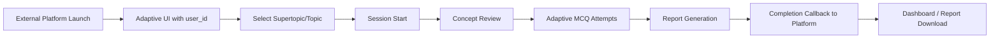
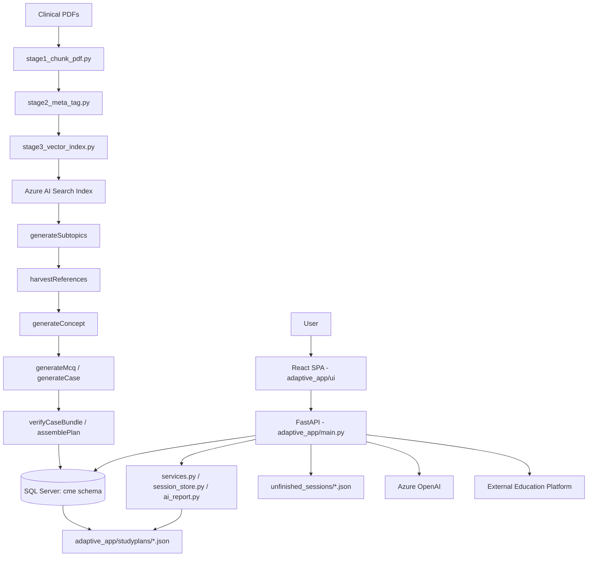
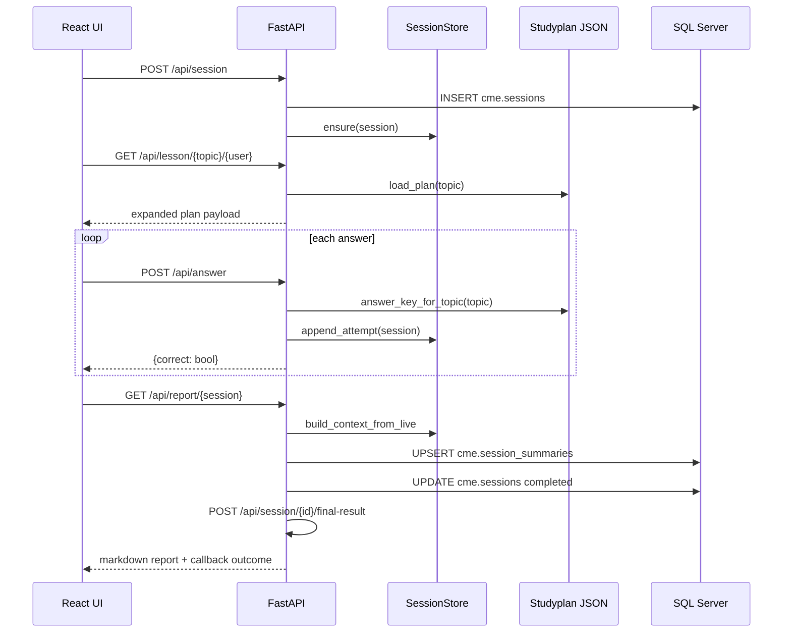
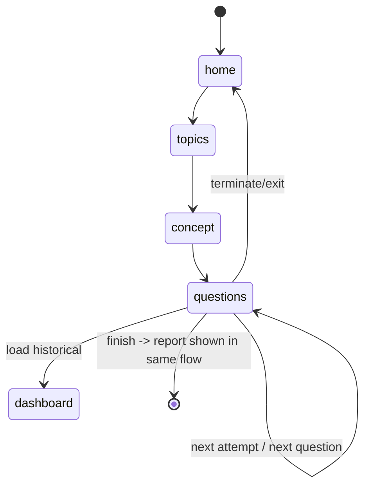
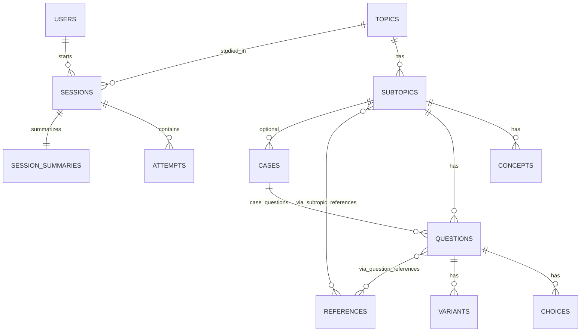
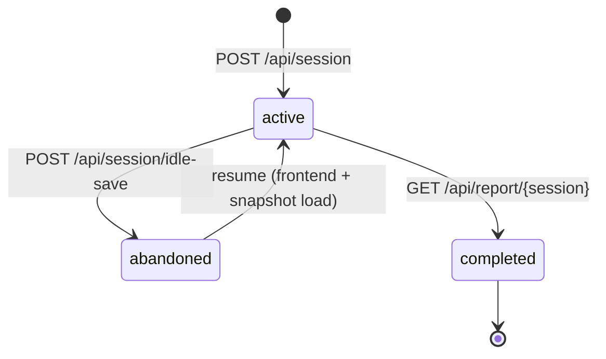
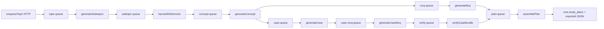

# AI-CME System Documentation

## 1. Product Overview

### What this system is
AI-CME is an adaptive pediatric CME learning platform composed of:
- A **runtime learner app** (`adaptive_app`) with FastAPI + React.
- A **content-generation pipeline** (`studyplan-pipeline`) built on Azure Functions queues.
- A **RAG ingestion/indexing pipeline** (`rag_pipeline`) that chunks clinical PDFs, enriches metadata, and pushes vectors to Azure AI Search.

The learner-facing app delivers concept-driven lessons, adaptive MCQ progression, resume/lock semantics, report generation, and external LMS/platform callback synchronization.

### Problem it solves
The system addresses core CME delivery problems:
- Turning large pediatric medical material into **structured curriculum units**.
- Delivering **adaptive assessment** (variant stems after incorrect answers).
- Preserving progress across interruptions through **snapshot + resume**.
- Producing actionable learner feedback via AI-generated markdown reports.
- Integrating with an external education platform for **launch authentication and completion reporting**.

### Core feature set
| Capability | Description |
|---|---|
| Supertopic/topic discovery | Topics are loaded from JSON study plans and grouped by `supertopic`. |
| Credit-gated catalog | Topic visibility can be filtered by user credit balance. |
| Adaptive assessments | Base question attempt (`variant_no=0`) plus variant retries. |
| Session locking | Prevents starting multiple unfinished sessions for a user. |
| Snapshot + resume | In-memory attempts are periodically checkpointed to disk JSON files. |
| Idle auto-save | Inactivity (5 minutes) marks session abandoned and persists state. |
| Dashboard/history | Historical sessions and scores (from DB summaries) displayed in UI. |
| AI report | Markdown performance report generated from session attempts. |
| Platform integration | Signed launch endpoint and completion callback endpoint. |

### Target users
- **Learners** (pediatric trainees/clinicians).
- **Education platform operators** (launching and tracking external users).
- **Content ops/admins** (running ingestion + plan generation pipelines).

### High-level user journey


---

## 2. System Architecture

### Architecture style
A pragmatic modular monolith + offline/async pipeline architecture:
1. **Online runtime app** (FastAPI + React) for learner interactions.
2. **Asynchronous authoring pipeline** (Azure Functions + queues) for generating/refining study plans.
3. **RAG preprocessing/indexing pipeline** for source content ingestion into Azure Search.

### Component diagram


### Runtime request/data flow


### Application layers
| Layer | Key files | Responsibility |
|---|---|---|
| API/controller | `adaptive_app/main.py` | Endpoint orchestration and HTTP contract management. |
| Domain service | `adaptive_app/services.py`, `adaptive_app/ai_report.py` | Plan loading/transformation, answer-key derivation, report context + LLM call. |
| State/session | `adaptive_app/session_store.py`, `adaptive_app/crud.py` | Live attempt buffering and snapshot persistence. |
| Persistence model | `adaptive_app/models.py`, `adaptive_app/database.py` | SQLAlchemy mappings and DB connection/session creation. |
| Frontend | `adaptive_app/ui/src/App.jsx` | State machine UI for learning, resume, dashboard, report. |
| Content pipeline | `studyplan-pipeline/*` | Topic expansion, references, concepts, MCQ/case generation, plan assembly. |
| Retrieval pipeline | `rag_pipeline/*` | PDF chunking, metadata tagging, vector indexing. |

---

## 3. Repository Structure

```text
.
├── adaptive_app/
│   ├── main.py
│   ├── services.py
│   ├── session_store.py
│   ├── ai_report.py
│   ├── models.py
│   ├── schemas.py
│   ├── crud.py
│   ├── database.py
│   ├── settings.py
│   ├── assessment.py
│   ├── studyplans/*.json
│   └── ui/
│       ├── src/App.jsx
│       ├── src/main.jsx
│       ├── package.json
│       └── vite.config.js
├── rag_pipeline/
│   ├── cfg.py
│   ├── stage1_chunk_pdf.py
│   ├── stage2_meta_tag.py
│   ├── stage3_vector_index.py
│   └── taxonomy/*.json
└── studyplan-pipeline/
    ├── host.json
    ├── enqueueTopic/
    ├── generateSubtopics/
    ├── harvestReferences/
    ├── generateConcept/
    ├── generateMcq/
    ├── generateCase/
    ├── generateCaseMcq/
    ├── verifyCaseBundle/
    └── assemblePlan/
```

---

## 4. Backend (Adaptive Runtime API)

### Endpoint inventory
| Method | Route | Purpose |
|---|---|---|
| GET | `/api/supertopics` | List all supertopics from plan JSON files. |
| GET | `/api/topics` | List topics with optional `supertopic` + credit gating by `user_id`. |
| GET | `/api/lock-status/{user_id}` | Return lock state (unfinished snapshots). |
| POST | `/api/session` | Start new session; blocked when user is locked. |
| POST | `/api/session/idle-save` | Persist snapshot, mark DB session abandoned, remove live memory. |
| POST | `/api/session/snapshot` | Save non-destructive snapshot for active session continuity. |
| GET | `/api/resume-status/{user_id}` | Return unfinished snapshot topics. |
| GET | `/api/resume/{user_id}/{topic_id}` | Load snapshot payload. |
| DELETE | `/api/resume/{user_id}/{topic_id}` | Delete unfinished snapshot. |
| GET | `/api/dashboard/{user_id}` | Session history with summary metrics. |
| GET | `/api/lesson/{topic_id}/{user_id}` | Return full plan JSON for a topic. |
| POST | `/api/answer` | Grade attempt using in-memory answer key derived from JSON plan. |
| GET | `/api/report/{session_id}` | Build or fetch markdown report; completes session. |
| POST | `/api/launch-from-platform` | Validate signed launch payload and map/create user. |
| POST | `/api/session/{session_id}/final-result` | Notify external platform with completion token/callback. |

### Notable runtime mechanics
1. **Content source of truth at runtime**: plan JSON files (not DB joins) are used for lesson retrieval and answer-key grading.
2. **Attempts storage split**:
   - Live attempts in `SessionStore` memory.
   - Optional legacy DB `attempts` path for report context fallback.
3. **Session lock model**:
   - Lock currently checks unfinished snapshot existence.
   - Prevents starting another topic session until resume/terminate.
4. **Report side effects**:
   - `/api/report/{session_id}` also marks session complete, clears live state, deletes idle snapshot, and triggers final-result callback.

### Pydantic contracts (selected)
- Learning: `StudyPlanOut`, `SubtopicOut`, `QuestionOut`, `ChoiceOut`, `VariantOut`.
- Session: `StartSessionIn`, `AnswerIn`, `AnswerOut`, `ReportOut`.
- Platform: `LaunchRequest`, `LaunchResponse`, `FinalResultResponse`.

---

## 5. Frontend (React SPA)

### UI state machine
The SPA uses internal `view` routing rather than React Router routes.



### Key client behaviors
- Reads `user_id` from URL query string.
- Bootstraps supertopics and unfinished-session checks on load.
- Polls lock status every 15s.
- Maintains cursor state: `subIdx`, `mcqIdx`, `attemptIdx`, tab/view history.
- Saves snapshots continuously (`/api/session/snapshot`) and on idle timeout (`/api/session/idle-save`).
- Adaptive retry logic:
  - wrong answer + remaining variants => delayed auto-advance to next variant stem.
- Dashboard can reopen historical reports and lesson context.

---

## 6. Data Model & Database Documentation

## 6.1 Database extraction status
The repository currently contains `adaptive_app/full_dump.sql` as a 2-byte placeholder and **does not include** `full_dump.sql.zip` in this checkout. Therefore, complete DDL and data-level introspection from dump SQL is not possible in this repository state.

**Schema documentation below is reconstructed from**:
1. SQLAlchemy models (`adaptive_app/models.py`) used by runtime.
2. SQL statements embedded in `studyplan-pipeline` functions.

## 6.2 Core runtime entities (from ORM)
| Table | Primary key | Purpose |
|---|---|---|
| `cme.topics` | `topic_id` | Topic metadata and credit cost. |
| `cme.subtopics` | `subtopic_id` | Ordered subtopic nodes under topics. |
| `cme.concepts` | `concept_id` | Concept text per subtopic. |
| `cme.questions` | `question_id` | Question stems/explanations. |
| `cme.choices` | `(question_id, choice_index)` | Choice options for questions. |
| `cme.variants` | `variant_id` | Alternative stems + correct indices. |
| `cme.references` | `reference_id` | Source excerpt/citation catalog. |
| `cme.question_references` | `(question_id, reference_id)` | M2M question↔reference bridge. |
| `cme.subtopic_references` | `(subtopic_id, reference_id)` | M2M subtopic↔reference bridge. |
| `cme.study_plans` | `topic_id` | Assembled plan JSON storage. |
| `cme.users` | `user_id` | Learner identity mapping + platform metadata. |
| `cme.sessions` | `session_id` | Attempt session lifecycle records. |
| `cme.attempts` | `attempt_id` | Legacy persisted attempts table. |
| `cme.session_summaries` | `session_id` | Session score + report markdown. |

## 6.3 Additional pipeline tables inferred from SQL usage
| Table | Observed use |
|---|---|
| `cme.cases` | Case vignettes attached to subtopics. |
| `cme.qa_reviews` | QA verdict records for MCQ/case validation. |
| `cme.content_gaps` | Coverage diagnostics for weak subtopics. |
| `cme.fail_log` | Pipeline stage failure logging. |

## 6.4 Relationship model (inferred)


## 6.5 Session lifecycle/state model


---

## 7. Studyplan JSON Contract

Each plan file in `adaptive_app/studyplans/*_1.json` follows an enriched structure similar to:

```json
{
  "topic_id": "uuid",
  "topic_name": "string",
  "supertopic": "string",
  "assembled_utc": "ISO datetime",
  "subtopics": [
    {
      "subtopic_id": "uuid",
      "subtopic_title": "string",
      "sequence_no": 1,
      "category": "string|null",
      "concept": "markdown/text",
      "references": [{"source_id":"...","citation_link":"...","excerpt":"..."}],
      "questions": [
        {
          "question_id": "uuid",
          "stem": "string",
          "explanation": "string",
          "correct_choice": "string",
          "correct_choice_index": 0,
          "choices": [{"choice_index":0,"choice_text":"...","rationale":"..."}],
          "variants": [{"variant_no":1,"stem":"...","correct_choice_index":2}],
          "references": []
        }
      ],
      "case_studies": []
    }
  ]
}
```

### Runtime transformation details
`services.py` additionally:
- Expands `case_studies` into virtual `is_case=true` subtopics.
- Normalizes case MCQ shape to standard question shape.
- Produces deterministic UUIDv5 for derived case subtopic IDs.
- Builds an answer key map: `(question_id, variant_no) -> correct_choice_index` with fallback inference.

---

## 8. Studyplan Pipeline (Azure Functions)

The `studyplan-pipeline` directory is a queue-orchestrated content assembly workflow.

### Function triggers
| Function | Trigger | Queue/API |
|---|---|---|
| `enqueueTopic` | HTTP | creates topic + initial subtopics, pushes `topic-queue` |
| `generateSubtopics` | Queue | `topic-queue` |
| `harvestReferences` | Queue | `subtopic-queue` |
| `generateConcept` | Queue | `concept-queue` |
| `generateMcq` | Queue | `mcq-queue` |
| `generateCase` | Queue | `case-queue` |
| `generateCaseMcq` | Queue | `case-mcq-queue` |
| `verifyCaseBundle` | Queue | `verify-queue` |
| `assemblePlan` | Queue | `plan-queue` |

### Pipeline flow


### Pipeline outputs
- Populates SQL tables (`topics`, `subtopics`, `concepts`, `questions`, `choices`, `variants`, `references`, case/QA tables).
- Emits quality/coverage metadata (`content_gaps`, `fail_log`).
- Produces assembled plan JSON consumable by runtime app.

---

## 9. RAG Pipeline Documentation

### Stages
1. **`stage1_chunk_pdf.py`**
   - Extracts text from PDFs.
   - Parses hierarchical headings (`topic;subtopic;sub-subtopic`).
   - Separates content from references.
   - Uploads chunks and manifests to Azure Blob.

2. **`stage2_meta_tag.py`**
   - Calls Azure OpenAI in JSON mode.
   - Produces metadata: summary, objectives, key facts, complexity, tags, hierarchy fields.
   - Generates small QA PDFs and JSON metadata artifacts.

3. **`stage3_vector_index.py`**
   - Embeds content using PubMedBERT (`768-dim` CLS embedding).
   - Handles blob URL normalization/recovery.
   - Uploads vectors and metadata to Azure AI Search index.

### Metadata strategy
Indexed documents retain hierarchical navigation fields (`topic`, `subtopic`, `sub_subtopic`, `sequence`) and reference indicators (`references`, `has_guidelines`, `reference_count`) to support downstream content-generation retrieval quality.

---

## 10. External Integrations

| Integration | Where used | Purpose |
|---|---|---|
| Azure OpenAI | `ai_report.py`, studyplan pipeline generators | Report authoring, concept/MCQ/case generation, QA checks. |
| Azure AI Search | `studyplan-pipeline`, `rag_pipeline` | Source chunk retrieval for references/content coverage. |
| Azure Blob Storage | `rag_pipeline` | Stores chunks/manifests/meta artifacts. |
| External Education Platform | `api/launch-from-platform`, `api/session/{id}/final-result` | User launch + completion acknowledgment and return redirect. |

---

## 11. Security, Reliability, and Operational Notes

### Security-critical observations
- Multiple files currently embed plaintext infrastructure credentials/API keys/DB connection strings.
- Secrets should be moved to environment variables/Key Vault only, with immediate rotation.

### Reliability notes
- Session attempts are primarily in-memory; process restarts can lose live state unless recently snapshotted.
- Duplicate route definition exists for `/api/resume-status/{user_id}` (later declaration wins).
- Report endpoint includes side effects (session completion + callback), so it should be treated as a terminal action.

### Suggested hardening roadmap
1. Remove hardcoded secrets and rotate all exposed credentials.
2. Persist attempts transactionally in DB (or Redis) for crash-safe report generation.
3. Separate report generation from completion callback as explicit independent operations.
4. Add formal migrations and schema docs (Alembic + ERD export).
5. Add idempotency keys for callback and queue processors.

---

## 12. Local Development & Runbook

### Runtime app
```bash
cd adaptive_app
pip install -r requirements.txt
uvicorn main:app --reload --host 0.0.0.0 --port 8000
```

### Frontend
```bash
cd adaptive_app/ui
npm install
npm run dev
```

### Studyplan pipeline (Azure Functions local)
```bash
cd studyplan-pipeline
pip install -r requirements.txt
# Requires Azure Functions Core Tools + local.settings.json / env vars
func start
```

### RAG pipeline
```bash
cd rag_pipeline
pip install -r requirements.txt
python stage1_chunk_pdf.py
python stage2_meta_tag.py
python stage3_vector_index.py --manifest manifest-2.json
```

---

## 13. Known Gaps in This Repository Snapshot

1. `full_dump.sql.zip` referenced in requirements is not present in this checkout.
2. `adaptive_app/full_dump.sql` is effectively empty, so data-level profiling (row counts/indexes/check constraints/triggers) cannot be produced from dump content.
3. Runtime uses both DB schema and filesystem/JSON sources; therefore, behavioral truth is split across code + JSON artifacts.

Despite those gaps, this document captures the actionable architecture, contracts, workflows, and inferred schema needed for engineering continuity.
