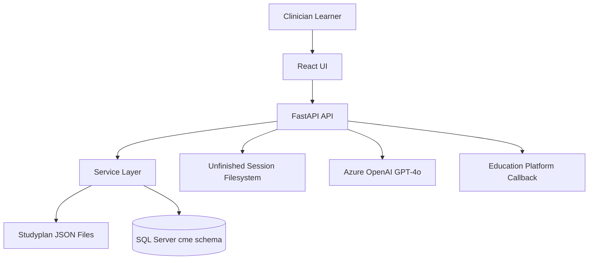
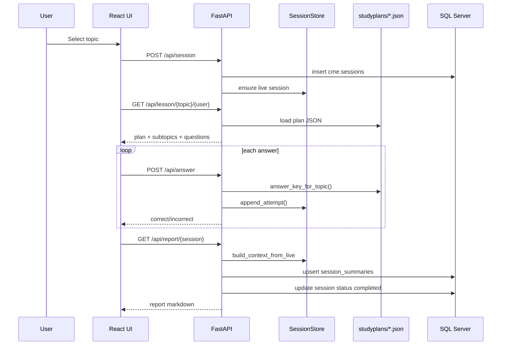
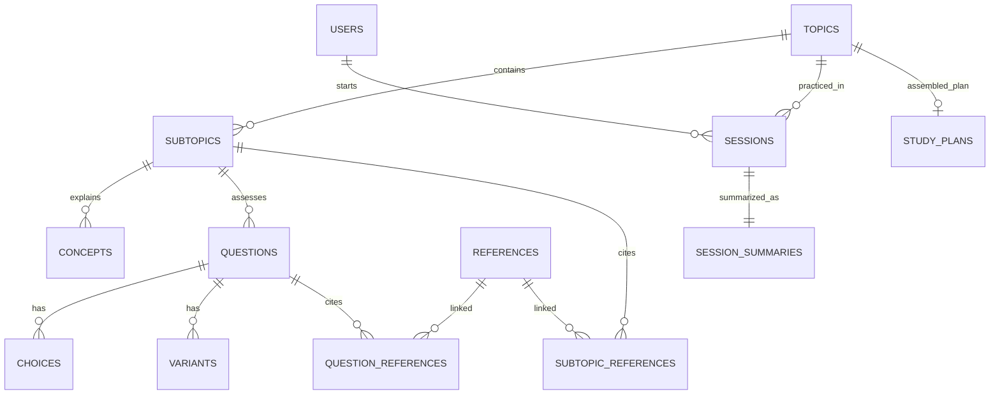
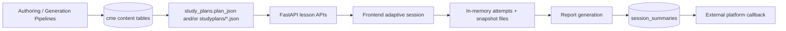

# Adaptive CME Learning Application — Complete Technical & Product Documentation

## 1) Product Overview

### What this system does
This repository contains a **full-stack adaptive learning system** for pediatric Continuing Medical Education (CME). It delivers topic-based lessons with concept reading, adaptive MCQ attempts (including variant stems), session locking/resume, progress tracking, GPT-generated performance reports, and platform callback integration for credits/result sync.

At runtime, the app consists of:
- A **FastAPI backend** serving learning APIs and orchestration logic.
- A **React + MUI frontend** presenting learning journeys (home → supertopics → topics → concepts → questions → report/dashboard).
- A **SQL Server schema** (plus JSON study plans) used for content and longitudinal session data.
- A **filesystem snapshot store** used for unfinished/live session recovery.

---

### Problem it solves
Clinical education users need:
- Structured pediatric topic coverage
- Immediate, adaptive formative assessment
- Session continuity across interruptions
- Objective reporting and progress records
- Integration with an external education platform (launch identity + credit callbacks)

This system addresses those needs with **content-first JSON lesson plans**, adaptive retry logic, and backend-managed reporting/callback workflows.

---

### Core features
- **Topic discovery by supertopic** with optional user-credit filtering.
- **Adaptive question flow**:
  - Initial attempt on base stem (`variant_no=0`)
  - Retry attempts on variant stems when incorrect
  - Stops once correct or variants exhausted
- **Resume/lock model**:
  - Automatic snapshots
  - Idle-save + abandonment handling
  - Resume and terminate controls
- **Dashboard/history** with status and score metadata.
- **AI report generation** from live attempts and/or historical attempts.
- **Platform launch + secure callback** for user mapping and credit result return.

---

### Target users / personas
- **Primary learner**: clinician/trainee completing adaptive pediatric learning modules.
- **Education platform**: external LMS/WordPress-like portal launching users and receiving completion callbacks.
- **Content/program admin**: reviews topic quality and QA artifacts (cases, reviews, references, coverage metadata).

---

### High-level user journey
1. External platform calls `/api/launch-from-platform` with signed launch payload.
2. App resolves/creates internal user mapped to platform UID.
3. Frontend opens with `?user_id=<uuid>`.
4. Learner selects supertopic → topic.
5. Backend starts a session and serves topic plan JSON.
6. Learner studies concepts, answers adaptive questions.
7. System records attempts in-memory and snapshots regularly.
8. On completion, report is generated and persisted.
9. Backend posts final completion callback (JWT tokenized) to external platform.
10. Learner can review dashboard and download report markdown.

---

## 2) System Architecture

### Architecture style
A **monolithic service architecture** with clear internal layers:
- Presentation: React SPA
- API/Controller: FastAPI endpoints
- Domain/application services: plan loading, grading, report context build
- Persistence:
  - SQL Server (canonical entities)
  - JSON files for content (`studyplans/*.json`)
  - Local filesystem snapshots (`unfinished_sessions/*.json`)

---

### Architecture diagram


### Layered components

| Layer | Components | Responsibilities |
|---|---|---|
| Frontend | `ui/src/App.jsx` | Navigation, adaptive interaction UI, session save/resume, dashboard/report views |
| API | `main.py` | Route handlers, validation, session orchestration, launch/callback security |
| Domain services | `services.py`, `ai_report.py`, `assessment.py` | Topic/plan loading, answer key generation, grading logic, report context + LLM report generation |
| Data access | `models.py`, `database.py`, `crud.py`, SQL dump | ORM entities and DB interaction patterns |
| Runtime state | `session_store.py` | In-memory attempts + persistent idle snapshots |
| Config | `settings.py` | DB/secret/OpenAI/launch settings |

---

### Request/data flow (learning session)


---

### External integrations
- **Azure OpenAI** (`ai_report.py`) for narrative report generation.
- **Education platform** for launch authentication and completion callback acknowledgment.

---

## 3) Repository Structure

```text
adaptive_app/
├── main.py                 # FastAPI app + all API routes
├── services.py             # topic discovery, plan load/normalization, answer keys
├── ai_report.py            # report context + Azure OpenAI call
├── session_store.py        # in-memory and snapshot session state
├── models.py               # SQLAlchemy ORM entities (cme schema)
├── schemas.py              # Pydantic contracts
├── crud.py                 # session creation/closure + in-memory attempt writer
├── database.py             # SQLAlchemy engine/session/base
├── settings.py             # environment and secret handling
├── assessment.py           # legacy thin scoring helper
├── full_dump.sql.zip       # SQL data export (unzipped to full_dump.sql)
├── studyplans/*.json       # topic-level assembled curriculum payloads
└── ui/
    ├── src/App.jsx         # single-page adaptive UX
    ├── src/main.jsx
    ├── tests/adaptive-flow.spec.ts
    ├── vite.config.js
    └── package.json
```

---

## 4) Backend API Documentation

### Endpoint catalog

| Method | Path | Purpose |
|---|---|---|
| GET | `/api/supertopics` | List unique supertopics from studyplan files |
| GET | `/api/topics` | List topics; optionally filter by supertopic and user credit balance |
| GET | `/api/lock-status/{user_id}` | Check if user has unfinished lock state |
| POST | `/api/session` | Start a new session (blocked if locked) |
| POST | `/api/session/idle-save` | Persist snapshot + mark session abandoned + remove live memory |
| POST | `/api/session/snapshot` | Persist non-destructive point-in-time snapshot |
| GET | `/api/resume-status/{user_id}` | List resumable unfinished snapshots |
| GET | `/api/resume/{user_id}/{topic_id}` | Load snapshot JSON |
| DELETE | `/api/resume/{user_id}/{topic_id}` | Delete unfinished snapshot |
| GET | `/api/dashboard/{user_id}` | Session history + summary stats |
| GET | `/api/lesson/{topic_id}/{user_id}` | Fetch expanded study plan for topic |
| POST | `/api/answer` | Grade answer via JSON key + append in-memory attempt |
| GET | `/api/report/{session_id}` | Generate or return session markdown report |
| POST | `/api/launch-from-platform` | Validate signed launch payload + map user |
| POST | `/api/session/{session_id}/final-result` | Send completion callback to platform |

> Note: `/api/resume-status/{user_id}` appears twice in `main.py`; later definition shadows earlier behavior.

---

### API contracts (selected)
- Request/response schemas are in `schemas.py`:
  - `StartSessionIn`, `AnswerIn`, `AnswerOut`
  - `StudyPlanOut` with nested subtopics/questions/choices/variants
  - `LaunchRequest`, `LaunchResponse`, `FinalResultResponse`

---

## 5) Frontend Application Behavior

### Navigation states
The app operates as a state machine using `view` in `App.jsx`:
- `home` (supertopic cards)
- `topics` (topic cards)
- `concept` (content-first reading)
- `questions` (adaptive MCQ flow + explanation/references tabs)
- `dashboard` (historical sessions)
- resume prompt modal/state for unfinished sessions

### Adaptive question logic
- Uses `attemptIdx` to select stem:
  - `0` → main question stem
  - `1..n` → variant stems
- On submit:
  - posts answer to backend
  - shows rationale for selected option
  - if incorrect and variants remain, triggers **5-second auto-next** to next variant
  - if correct or no variants left, transitions to explanation mode

### Session resilience
- Background non-destructive snapshots to `/api/session/snapshot`.
- Idle timeout (5 minutes inactivity) triggers `/api/session/idle-save`.
- On reload, app asks learner to continue or terminate unfinished sessions.
- `beforeunload` guard prevents accidental window close when locked.

### Dashboard/report UX
- Dashboard retrieves rows from `/api/dashboard/{user_id}`.
- Report pulled from `/api/report/{session_id}` and can be downloaded as markdown.

---

## 6) Data Model & Database Analysis

## 6.1 SQL dump extraction summary
`full_dump.sql.zip` contains `full_dump.sql` (~55 MB) with **data inserts grouped by table**, not full DDL in this export. The dataset covers content generation QA artifacts, learning content entities, references, and limited learner/session history.

### Tables discovered in dump (`cme` schema)
1. `cases`
2. `qa_reviews`
3. `content_gaps`
4. `session_summaries`
5. `attempts`
6. `choices`
7. `concepts`
8. `questions`
9. `subtopics`
10. `topics`
11. `variants`
12. `fail_log`
13. `question_references`
14. `references`
15. `sessions`
16. `study_plans`
17. `subtopic_references`
18. `users`

### Insert volume profile (from dump)

| Table | Approx inserted rows (statement count) |
|---|---:|
| `choices` | 18,452 |
| `question_references` | 18,401 |
| `variants` | 9,226 |
| `qa_reviews` | 7,290 |
| `subtopic_references` | 5,793 |
| `questions` | 4,613 |
| `references` | 3,262 |
| `subtopics` | 1,719 |
| `concepts` | 1,619 |
| `cases` | 1,485 |
| `fail_log` | 876 |
| `content_gaps` | 101 |
| `topics` | 42 |
| `study_plans` | 36 |
| `users` | 4 |
| `session_summaries` | 2 |

> `sessions` and `attempts` are present as table sections in dump but appear to have no insert statements in this export snapshot.

---

## 6.2 ORM canonical schema (from `models.py`)

### Core learning entities
- `topics(topic_id, topic_name, credits, ... )`
- `subtopics(subtopic_id, topic_id, title, sequence_no, status, ...)`
- `concepts(concept_id, subtopic_id, content, token_count)`
- `questions(question_id, subtopic_id, stem, explanation, correct_choice)`
- `choices(question_id, choice_index, choice_text, choice_id)`
- `variants(variant_id, question_id, variant_no, stem, correct_choice_index)`
- `references(reference_id, source_id, citation_link, excerpt)`
- bridge tables: `question_references`, `subtopic_references`
- `study_plans(topic_id, assembled_utc, plan_json)`

### Learning runtime entities
- `users(user_id, email, platform_user_id, credit_balance, return_url_post, return_url_get, ... )`
- `sessions(session_id, user_id, topic_id, started_utc, ended_utc, status, last_activity_utc)`
- `attempts(...)` (declared; app currently writes attempts in memory, not DB)
- `session_summaries(session_id, user_id, topic_id, score_pct, report_markdown, per_subtopic_json, ... )`

---

### Entity relationship diagram


---

## 6.3 Content format (`studyplans/*.json`)
Each topic file includes:
- `topic_id`, `topic_name`, optional `supertopic`
- `subtopics[]` with `subtopic_id`, `subtopic_title`, `concept`, references, questions
- question objects with main stem + `variants[]` + choices + explanations
- optional `case_studies[]` which backend expands into virtual subtopics

This is the **primary serving source** for lessons and answer keys in the current runtime.

---

## 7) Adaptive Algorithm & Business Logic

### Answer grading source of truth
- Grading does **not** query DB variants during session flow.
- `services.answer_key_for_topic(topic_id)` builds an in-memory key from JSON:
  - `(question_uuid, 0)` → main stem correct index
  - `(question_uuid, variant_no)` → variant correct index

### Adaptive progression rules
1. Learner submits answer with `variant_no = attemptIdx`.
2. Backend validates against answer key and stores attempt in `SessionStore`.
3. Frontend behavior:
   - Correct → explanation → proceed
   - Incorrect and variants remain → auto-advance to next variant after countdown
   - Incorrect and no variant left → explanation

### Session locking rules
- User is considered locked when unfinished snapshot exists (`is_locked` currently checks file snapshots).
- `/api/session` denies new session if locked (HTTP 409).
- Idle-save transitions DB session status to `abandoned` and persists snapshot.

---

## 8) Report Generation Pipeline

### Context builders
- **Preferred**: `build_context_from_live(topic_id, session_id)` reads in-memory attempts and enriches with subtopic metadata from plan.
- **Fallback**: `build_context(db, session_id)` tries DB attempts table.

### LLM generation
- `run_gpt_report(ctx)` sends a structured prompt to Azure OpenAI and expects markdown output with:
  - overall score
  - strengths
  - knowledge gaps
  - missed question table
  - targeted next steps

### Persistence
Report endpoint upserts `session_summaries`, updates session status to `completed`, clears live store, removes idle snapshot, and triggers final-result callback.

---

## 9) Platform Integration & Security Model

### Launch flow (`/api/launch-from-platform`)
- Validates `X-Launch-Signature` using HMAC-SHA256 over canonical JSON.
- Validates `iat/exp` timestamps.
- Maps platform `uid` to internal `users.platform_user_id`; creates/updates user.
- Returns internal `user_id` UUID.

### Final result callback (`/api/session/{id}/final-result`)
- Requires session + topic + user + summary availability.
- Computes score, time spent, and negative `credits_earned` from `topic.credits`.
- Generates short-lived HS256 JWT and appends as query token to `return_url_post`.
- Expects platform JSON ACK (`status=received` or `ok=true`).
- Returns redirect URL for frontend.

### Security notes
- HMAC signing implemented, but several secrets/keys are hardcoded defaults in repository code and should be externalized immediately for production.

---

## 10) Configuration & Environment

### Backend dependencies
- FastAPI, Uvicorn
- SQLAlchemy + pyodbc (SQL Server)
- Pydantic v2
- OpenAI SDK (AzureOpenAI client)

### Key configuration variables
- `DATABASE_URL`
- `LAUNCH_SIGNING_SECRET`
- `AZURE_OPENAI_DEPLOYMENT`
- optional KeyVault-related vars if `USE_KEY_VAULT=True`

### Frontend runtime
- Vite dev server with `/api` proxy to `http://localhost:8000`.

---

## 11) Testing & Quality Signals

### Present tests
- Playwright scenario (`ui/tests/adaptive-flow.spec.ts`) runs multi-round adaptive flows, report checks, and failure screenshots.

### Observed characteristics
- Large, stress-style E2E loop (`ROUNDS=100`) indicates load/stability-oriented testing intent.
- Backend includes a mix of current and legacy code paths (live-store vs DB attempts fallback).

---

## 12) Known Risks, Gaps, and Improvement Opportunities

1. **Secrets in source code** (DB/OpenAI key and signing fallback values).
2. **Duplicate endpoint definition** (`/api/resume-status/{user_id}` appears twice).
3. **Inconsistent attempts persistence**:
   - `models.Attempt` exists
   - runtime writes attempts only in memory
   - legacy DB-based report fallback may fail if no DB attempts exist
4. **Potential SQLAlchemy mismatch in `crud.fetch_study_plan` joinedload relation names** against model names.
5. **Session lock semantics**: current lock check is snapshot-based only, while active in-memory sessions are tracked separately.
6. **Hardcoded production-like infrastructure values** in configuration files.
7. **Monolithic `App.jsx`** size/complexity limits maintainability and testability.

---

## 13) Suggested Refactoring Roadmap

### Phase 1 — Security + correctness
- Move all credentials/secrets to environment/Key Vault.
- Remove duplicate route declaration.
- Standardize launch signature function usage (eliminate unused verifier variants).

### Phase 2 — Data consistency
- Decide canonical attempt storage strategy:
  - DB-backed attempts (recommended for analytics/audit), or
  - explicit in-memory-only mode with no DB fallback code.
- Add migrations for columns present in dump but absent in ORM where required.

### Phase 3 — Modularization
- Split frontend into feature modules: routing, session, question engine, dashboard/report.
- Extract backend routers (`topics`, `sessions`, `integration`, `reports`).
- Add service interfaces for report generation and platform callback.

### Phase 4 — Observability & ops
- Add structured logging, request IDs, callback retry queue, and metrics.
- Add CI for lint/type checks/unit tests and deterministic E2E subset.

---

## 14) Local Development Guide

### Backend
```bash
cd adaptive_app
python -m venv .venv
source .venv/bin/activate
pip install -r requirements.txt
uvicorn main:app --reload --host 0.0.0.0 --port 8000
```

### Frontend
```bash
cd adaptive_app/ui
npm install
npm run dev
```

### End-to-end
- Frontend: `http://localhost:3000`
- Backend API: `http://localhost:8000`
- Vite proxy forwards `/api` to backend.

---

## 15) Data Lifecycle Summary



---

## 16) Appendix — Quick Reference Tables

### Critical backend files

| File | Why it matters |
|---|---|
| `main.py` | All public API behavior, session orchestration, platform integration |
| `services.py` | Topic discovery and answer-key logic from JSON plans |
| `session_store.py` | Session continuity and lock mechanics |
| `ai_report.py` | Report context and Azure GPT call |
| `models.py` | Canonical ORM schema expectations |
| `schemas.py` | API contract definitions |

### Critical frontend files

| File | Why it matters |
|---|---|
| `ui/src/App.jsx` | Entire product UX and adaptive client logic |
| `ui/tests/adaptive-flow.spec.ts` | End-to-end learning-flow behavior expectations |
| `ui/vite.config.js` | Backend API proxy wiring |

---

## 17) Final Understanding Snapshot

This application is a **production-intent adaptive medical learning platform** with strong content depth, adaptive retry/report mechanics, and external LMS integration. Its current architecture is functionally rich but relies on a hybrid persistence model (JSON plans + SQL + filesystem live state) and includes several maintainability/security risks that should be addressed before scale deployment.

Even so, with this repository + SQL dump + this documentation, a new developer/AI can fully reconstruct:
- the end-to-end user flow,
- API contracts and orchestration logic,
- adaptive assessment behavior,
- schema/domain model,
- integration boundaries,
- and the key refactoring priorities.
